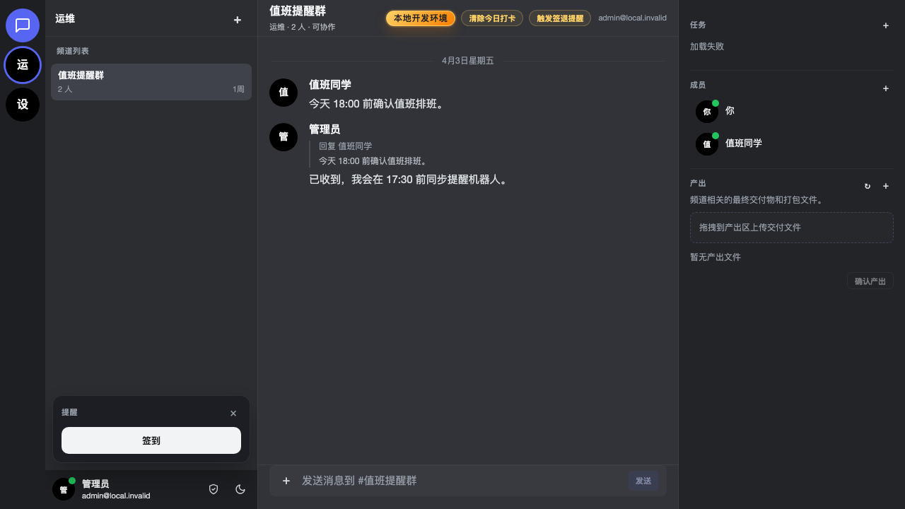

<div align="center">

# SekerChat

### 面向小团队的自托管实时协作工作区

把频道、私聊、文件、机器人和提醒放在自己的服务器上。

[](https://github.com/Seker800/SekerChat/actions/workflows/ci.yml)
[](./LICENSE)

[快速开始](#快速开始) · [部署指南](./APP/docs/synology-deployment.md) · [架构设计](./APP/docs/architecture.md) · [参与贡献](./CONTRIBUTING.md)

</div>



> [!NOTE]
> SekerChat 正处于 `1.0` 前的活跃开发阶段，接口、部署流程和数据模型仍可能调整。欢迎试用、反馈和贡献；正式部署前请先阅读部署与安全文档。

## 为什么选择 SekerChat

SekerChat 为希望掌控数据和运行环境的小团队提供一套完整、可自托管的沟通工作区。它不是只展示聊天界面的原型：消息、成员关系、文件引用和后台任务都有明确的持久化边界，并配套本地开发、自动化测试与群晖部署流程。

- **团队沟通**：使用服务器、频道和私聊组织讨论，支持实时消息、回复、成员状态和阅读进度。
- **文件协作**：通过 S3 兼容对象存储上传图片与文件，并支持受控的外部文件分享。
- **自动化能力**：机器人、提醒、缩略图和通知通过可重试任务执行，不阻塞核心消息写入。
- **数据自主**：前端、后端、PostgreSQL 与 MinIO 均可运行在自己的基础设施中。
- **安全边界**：浏览器使用 HttpOnly Cookie 会话，设备与 CLI 使用独立凭据契约；开发环境与生产数据面严格隔离。
- **可维护架构**：模块化单体、类型化 API 契约、持久化 outbox，以及自动化架构边界检查。

## 技术架构

| 层级       | 实现                                                   |
| ---------- | ------------------------------------------------------ |
| Web 客户端 | React、Vite、React Router、TanStack Query、Zustand     |
| 后端       | NestJS、Prisma、HTTP API、WebSocket                    |
| 数据       | PostgreSQL、MinIO / S3 兼容对象存储                    |
| 工程       | TypeScript、Playwright、Docker Compose、GitHub Actions |

SekerChat 采用模块化单体：PostgreSQL 是业务事实来源，MinIO 保存对象，WebSocket 负责低延迟投递。消息等业务写入与事件意图在同一数据库事务中提交，再由 outbox worker 处理实时通知、机器人和其他可重试副作用。

详细约束和主要流程见[架构文档](./APP/docs/architecture.md)与[架构决策记录](./APP/docs/adr)。

## 快速开始

### 环境要求

- Node.js 22
- Docker 与 Docker Compose
- npm 10 或更高版本

### 启动本地环境

```bash
git clone https://github.com/Seker800/SekerChat.git
cd SekerChat/APP
npm ci

cp deploy/local-dev/.env.example deploy/local-dev/.env
cp apps/backend/.env.example apps/backend/.env.development.local

docker compose --env-file deploy/local-dev/.env \
  -f deploy/local-dev/docker-compose.yml up -d

npm run prisma:generate --workspace @sekerchat/backend
npm run prisma:migrate --workspace @sekerchat/backend
npm run dev:backend
```

在另一个终端启动前端：

```bash
cd SekerChat/APP
npm run dev:frontend
```

然后打开 [http://localhost:5173](http://localhost:5173)。环境变量说明、登录准备和故障排查见[本地开发手册](./APP/docs/local-dev-runbook.md)。

## 部署

当前维护的生产模型是在群晖 NAS 上运行 frontend、backend、PostgreSQL 和 MinIO。应用发布与数据库迁移是相互独立的操作，生产密钥只保存在部署主机上。

- [环境模型](./APP/docs/environment-model.md)
- [群晖部署手册](./APP/docs/synology-deployment.md)
- [密钥存储指南](./APP/docs/secret-storage-guide.md)

如果要发布自己的 fork，请先替换示例配置中的域名、身份提供方、管理员账户和凭据，不要复用任何开发环境密钥。

## 仓库结构

```text
SekerChat/
├── APP/
│   ├── apps/
│   │   ├── backend/          # NestJS API 与后台任务
│   │   ├── frontend-react/   # React Web 客户端
│   │   └── reminder/         # 独立提醒客户端
│   ├── packages/             # 共享类型与 API 契约
│   ├── deploy/               # 本地开发和群晖部署配置
│   ├── docs/                 # 架构、运行与开发文档
│   └── tests/                # Playwright 端到端测试
├── CONTRIBUTING.md
├── SECURITY.md
└── LICENSE
```

## 开发与验证

```bash
cd APP
npm run lint
npm run typecheck
npm run test:unit
npm run build
npm run architecture:check
npm run open-source:check
npm run security:audit:ci
```

Web 界面改动还应运行 `npm run review:web`，检查关键流程与视觉快照。完整命令和测试边界见[应用工作区说明](./APP/README.md)。

## 文档

- [文档索引](./APP/docs/README.md)
- [本地开发手册](./APP/docs/local-dev-runbook.md)
- [HTTP API 契约](./APP/docs/http-api-contract.md)
- [实时事件契约](./APP/docs/realtime-contract.md)
- [开源发布流程](./APP/docs/open-source-release.md)
- [已登记的依赖风险](./APP/docs/dependency-risk-register.md)

## 参与贡献

欢迎提交 Issue 和 Pull Request。开始之前请阅读[贡献指南](./CONTRIBUTING.md)，并让一次变更只解决一个内聚问题。行为变更需要相应测试，界面变更需要可见结果验证。

发现安全问题时，请按照[安全策略](./SECURITY.md)私下报告，不要在公开 Issue 中披露漏洞、凭据或用户数据。

## 许可证

SekerChat 源代码采用 [GNU Affero General Public License v3.0](./LICENSE)（`AGPL-3.0-only`）许可。

第三方内容以及带有独立来源或使用限制说明的素材不自动包含在该授权中；使用或再分发前，请以对应目录内的来源与许可说明为准。
